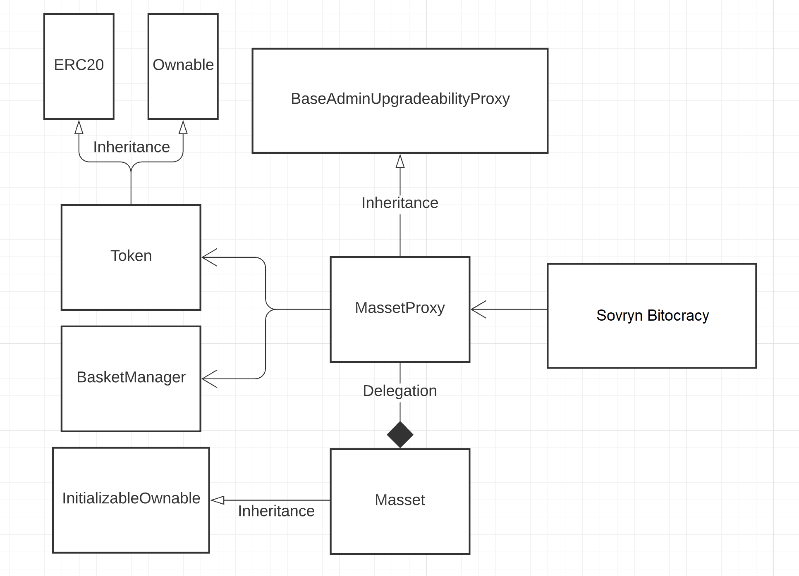

## 0. About

Mynt is a stablecoin aggregator based on [BabelFish](https://github.com/BabelFishProtocol/babelfish-phase-1). In contrast to BabelFish, which supports stablecoins with many different types of collateral backing, the stablecoins that Mynt supports are exclusively backed by BTC. Users can use Mynt to convert between supported "bAsset" stablecoins and the Mynt "mAsset" stablecoin at a 1:1 ratio. The Mynt mAsset stablecoin is the Sovryn Dollar (DLLR).

By aggregating multiple different BTC-backed stablecoins, each with their own issuance and stability mechanisms, DLLR has the potential to be more resilient, stable, and scalable than any of the underlying stablecoins on their own.

## 1. Documentation

Documentation for contracts can be found in `/docs` directory.
To generate documentation use "yarn docgen" command.

## 2. Scripts

Project scripts are defined in `package.json` file. To execute the script run the following command: `yarn command`, for example `yarn migrate`. 
Here is the list of available scripts:
-    "deploy" - run migrations, development network
-    "deploy:ropsten" - run migrations, ropsten network
-    "deploy:kovan" - run migrations, kowan network
-    "deploy:rskTestnet" - run migrations, rsk testnet network
     "deploy-governance" - run migrations of governance contracts, development network
     "deploy-governance:ropsten" - run migrations of governance contracts, ropsten network
     "deploy-governance:kovan" - run migrations of governance contracts, kovan network
     "deploy-governance:rskTestnet" - run migrations of governance contracts, rskTestnet network
-    "lint" - run linter
-    "lint-ts" - run typescript linter
-    "lint-sol" - run solidity linter
-    "coverage" - check unit test coverage
-    "script" - run custom script development network
-    "script:rskTestnet" - run custom script, rsk testnet
-    "script:rsk" - run custom script, rsk testnet
-    "test" - run all tests
-    "test-file" - run just one test file
-    "test:fork" run tests on fork network
-    "compile" - install project dependencies and compile
-    "prettify" - run prettier on source files
-    "flatten" - run flattener on source files
-    "prepublishOnly" - compile
-    "docgen" - generate documentation from solidity Natspecs
-    "fork:rsk-mainnet": "hardhat node --fork https://mainnet4.sovryn.app/rpc"
-    "fork:rsk-testnet": "hardhat node --fork https://testnet.sovryn.app/rpc"

## 3. Governance migration

##### Here are the steps needed to properly deploy and integrate a governance system:
-   Run contracts migrations: `yarn migrate-governance` (this script will queue the transferAdmin call)
-   To set the proper admin you need to execute the "transferAdmin" task after sufficient time delay. `yarn hardhat transferAdmin`
-   Integrate governance system by changing owner of selected contracts by executing `yarn hardhat run scripts/governanceIntegration.ts`

## 4. How do fees work

Fees are currently disabled. But if they are ever enabled, here is how they will work:

##### **`- mint`**( take bAssets, mint mAssets in exchange )
&NewLine;
##### **- fees**
-   substract fee from calculated mAsset mint amount
-   fees does not impact the amount of bAssets, all of them are transfered to pool 

##### **`- redeem`**( burn mAssets, transfer bAssets from pool in exchange  )
&NewLine;
##### **- fees**
-   transfer calculated amount before all conversions
-   substract from massets to burn and bassets to transfer

## 5. Graph

