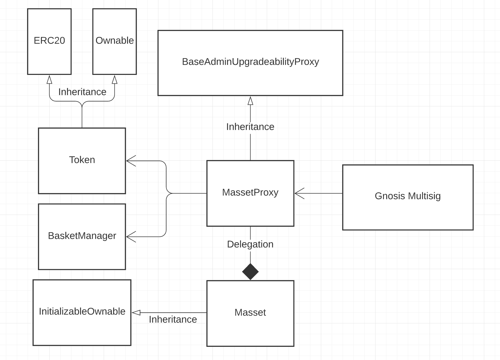

## **1. Documentation**

Documentation for contracts can be found in /docs directory.
To generate documentation use "yarn docgen" command.

## **2. Scripts**

Project scripts are defined in _pachage.json_ file. To execute the script run the following command: _yarn command_, for example _'yarn migrate'_. 
Here is the list of available scripts:
-    "deploy" - run migrations, development network
-    "deploy:ropsten" - run migrations, ropsten network
-    "deploy:kovan" - run migrations, kowan network
-    "deploy:rskTestnet" - run migrations, rsk testnet network
     "deploy-governance" - run migrations of governance contracts, development network
     "deploy-governance:ropsten" - run migrations of governance contracts, ropsten network
     "deploy-governance:kovan" - run migrations of governance contracts, kovan network
     "deploy-governance:rskTestnet" - run migrations of governance contracts, rskTestnet network
     "deploy-mynt-token" - deploy MyntToken, development network
     "deploy-fish-token" - deploy FishToken, development network
-    "lint" - run linter
-    "lint-ts" - run typescript linter
-    "lint-sol" - run solidity linter
-    "coverage" - check unit test coverage
-    "script" - run custom script development network
-    "script:rskTestnet" - run custom script, rsk testnet
-    "script:rsk" - run custom script, rsk testnet
-    "test" - run all tests
-    "test-file" - run just one test file
-    "test:fork" run tests on fork network
-    "compile" - install project dependencies and compile
-    "prettify" - run prettifyier on source files
-    "flatten" - run flattener on source files
-    "prepublishOnly" - compile
-    "docgen" - generate documentation from solidity Natspecs

## **3. Governance migration**

##### Here are the steps needed to properly deploy and integrate governance system:
-   Run contracts migrations: `yarn migrate-governance` (this script will queue the transferAdmin call)
-   To set the proper admin you need to execute the "transferAdmin" task after sufficient time delay. `yarn hardhat transferAdmin`
-   Integrate governance system by changing owner of selected contracts by executing `yarn hardhat run scripts/governanceIntegration.ts`

## **4. How does fees work**

##### **`- mint`**( take bAssets, mint mAssets in exchange )
&NewLine;
##### **- fees**
-   substract fee from calculated mAsset mint amount
-   fees does not impact the amount of bAssets, all of them are transfered to pool 

##### **`- redeem`**( burn mAssets, transfer bAssets from pool in exchange  )
&NewLine;
##### **- fees**
-   transfer calculated amount before all conversions
-   substract from massets to burn and bassets to transfer

## **5. Graph**

